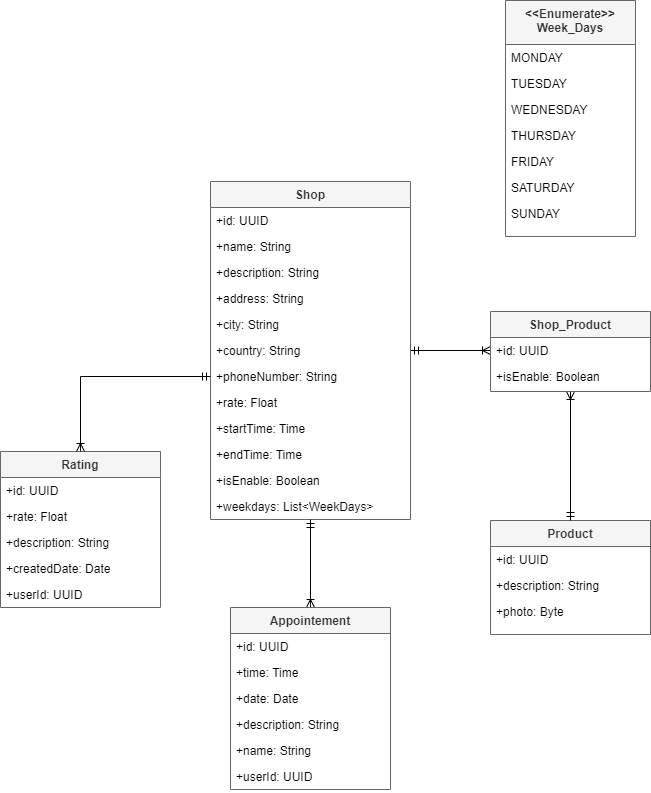

# SHARE AND SELL - Architecture Document

This document seeks to develop the Architecture of a demo project called Share and Sell. The client in this exercise is a owner of multiple shops, and he needs a app that allows to manage allthe shops he owns.

The idea of this project is to start my software architecture journey, by making this document it will allow me to create the architecture in question, in multiple languages:

Backend:

* Java Spring;
* Golang;
* C++;
* C#;
* Python;
* Rust.

Frontend:

* Angular;
* React;

Mobile:

* Flutter;
* Kotlin;
* Swift.

# Requirements

### Functional Requirements:

* Share and manage shops;
* Manage products for each shop;
* Send notification to users;
* Allow the user to see the shops in a virtual map;
* Allow Users to make apointments to each shop;
* Users can see the products e content of each shop;
* Users can save shops as favorites;
* Users can leave comentaries and ratings in shops.

### Non-Functional Requirements:

* Data Volume: 50GB Annually;
* Load: 50 concurrent requests;
* Number of Users: 2000;
* Message loss: 1%.

# Executive Summary

This document describes the architecture of the application for the company ShareAndSell, it will allow the users to see all the shops in a virutal map, and also see the products that each shop sells. It will also be possible for the administrator to manage all the shops and also manage all the products.

When developing this architecture we will use the most recent tecnologies and the most up-to-date ebst practices and methodologies, ensuring high-availability, performance and stability.

The application will be divided in two interfaces, there will be a Web and a Mobile. The first one will work as a Backoffice, for the administrator to manage the shops, the products, the notifications and the users. The second one will be a mobile app for the regular users to visualize the shops, the products, the notifications and to make appointements.

Here is a high-level overview of the architecture:

The application will be comprised of four separate services:

* User-Service: This service will be responsible with the management of all users of the system.
* Shop-Service: This service will be responsible with the management of all shops off the system and all products that can be sold in each shop;
* Notification-Service: This service will be responsible with the management of all notifications;
* Logs-Service: This service will be responsible with the collection and storage off all Loggs of each service.

# User-Service

The User-Service, is the service that will manage all users accounts, that include:

* Create User;
* Update User;
* Get all users;
* Get User by id;
* Delete User;
* Login.

The User managment will be done by Keycloak, which is an open-source identity and access management (IAM) solution that provides features for authentication, authorization, and user management.

Normally the Keycloak, saves the users, but to make operations like update or get can make the system slow, so we will also save all the information of the users in a postgres database, where any operation will be made first to the sql database and after that the cnages will be sent to keycloak.

Here is a class diagram of the user-service:

As we can see, it will be a simple system, the important part is to save the data before sending to the keycloak, just to make the operations faster.

For last, here is the API actions of this service, the actions will be displayed in the follow table:

| Functionality                         | Path                           |
| ------------------------------------- | ------------------------------ |
| Get all users in the system           | GET /api/user             |
| Get one user by id                    | GET /api/user/{userId}    |
| Get the current user (via HttpHeader) | GET /api/user/mine        |
| Update user by id                     | PATCH /api/user/{userId}  |
| Create user                           | POST /api/user            |
| Delete user                           | DELETE /api/user/{userId} |

The method to get all **users** in the system will have some filters they being:

| Name     | Type    |
| -------- | ------- |
| isEnable | Boolean |
| search   | String  |

The search string will search the follow variables, using ElasticSearch:

* email;
* firstName;
* fullName;
* city;
* country.

# Shop-Service

The Shop-Service, is the service that will manage all shops and products, that include:

* Create Shop;
* Update Shop;
* Get Shop by id;
* Get all Shops;
* Create Product;
* Update Product;
* Get Product by id;
* Get All Product;
* Get Comments;
* Create Comment:
* Rate a Shop;
* Give a like;
* Make an appointment;
* Get all appointments;
* Delete appointment;
* Update appointment.

As we can see the Shop-Service is the most complex service in all system, it will focus on the main functionalities the system provides. All the data that comes from this service will be stored in a postgres database.

Here is a class diagram of the shop-service:

For last, here is the API actions of this service, the actions will be displayed in the follow table:

| Functionality               | Path                                   |
| --------------------------- | -------------------------------------- |
| ##########                  | **Shop**                         |
| Get all shops               | GET /api/shop                     |
| Get shop by id              | GET /api/shop/{id}                |
| Create shop                 | POST /api/shop                    |
| Update shop by id           | PATCH /api/shop/{id}              |
| Delete shop by id           | DELETE /api/shop/{id}             |
| Get Rate from shop by id    | GET /api/shop/{id}                |
| ##########                  | **Product**                      |
| Get all products            | GET /api/product                  |
| Get product by id           | GET /api/product/{id}             |
| Create product              | POST /api/product                 |
| Update product by id        | PATCH /api/product/{id}           |
| Delete product by id        | DELETE /api/product/{id}          |
| ##########                  | **Shop_Product**                 |
| Get products by shop id     | GET /api/shop-product/{shopId}    |
| Update shop_product by id  | PATCH /api/shop-product/{id}      |
| Get shops by product id     | GET /api/shop-product/{productId} |
| ##########                  | **Ratting**                      |
| Create a rating             | POST /api/ratting                 |
| Get ratings by shop id      | GET /api/ratting/{shopId}         |
| Get ratings by user id      | GET /api/ratting/{userId}         |
| ##########                  | **Appointement**                 |
| Create a appointement       | POST /api/appointement            |
| Update appointement by id   | PATCH /api/appointement/{id}      |
| Delete appointment by id    | DELETE /api/appointement/{id}     |
| Get all appointments        | GET /api/appointement             |
| Get appointment by id       | GET /api/appointement/{id}        |
| Get appointments by user id | GET /api/appointement/{userId}    |
| Get appointments by shop id | GET /api/appointement/{shopId}    |

The method to get all **shops** in the system will have some filters they being:

| Name     | Type    |
| -------- | ------- |
| isEnable | Boolean |
| search   | String  |
| ratting  | Float   |

The search string will search the follow variables, using ElasticSearch:

* name;
* address;
* city;
* phoneNumber;
* country.

The method to get all **products** in the system will have some filters they being:

| Name     | Type    |
| -------- | ------- |
| isEnable | Boolean |
| search   | String  |

The search string will search the follow variables, using ElasticSearch:

* name.

The method to get all **ratting** in the system will have some filters they being:

| Name        | Type  |
| ----------- | ----- |
| createdDate | Date  |
| rate        | Float |

The method to get all **appointments** in the system will have some filters they being:

| Name   | Type   |
| ------ | ------ |
| date   | Date   |
| time   | Time   |
| search | String |

The search string will search the follow variables, using ElasticSearch:

* name.

# Notification-Service

The notification service will be responsible with creating and sending notifications, the notifications will be stored in a mongoDB database and we will use RabbitMQ to deliver the notifications to each user.

We will user RabbitMQ because RabbitMQ is a message-oriented middleware that provides a robust and scalable platform for message queuing. It is built on the Advanced Message Queuing Protocol (AMQP) and offers support for various messaging patterns, including publish/subscribe, request/reply, and point-to-point messaging.

We will also use mongoDB which is a non relational database instead of a relational database because the data which we will be using is doesn't fit neatly into structured tables with fixed schemas.

The schema for the notifications will be this:

{

    "id": "5dfe3d8d-a722-4e16-9283-348576942171",

    "timeStamp": "2023-09-02T20:33:32+0000",

    "title": "Black friday promotion",

    "description": "There is a promotion in the shop 50"

}

For last, here is the API actions of this service, the actions will be displayed in the follow table:

| Functionality             | Path                               |
| ------------------------- | ---------------------------------- |
| Get all notifications     | GET /api/notification         |
| Get notification by id    | GET /api/notification/{id}    |
|                           |                                    |
| Update notification by id | PATCH /api/notification/{id}  |
| Create notification       | POST /api/notification        |
| Delete notification by id | DELETE /api/notification/{id} |

The method to get all **ratting** in the system will have some filters they being:

| Name      | Type    |
| --------- | ------- |
| timeStamp | Date    |
| read      | Boolean |
| search    | String  |

The search string will search the follow variables, using ElasticSearch:

* title.

# Logs-Service

The Logs service will be responsible with all the logs of the system. They are importante because logs help diagnose issues and fix errors, support real-time performance monitoring, enhance security and compliance efforts, optimize resource usage, aid in capacity planning, maintain a historical record of system activities, and provide crucial insights during investigations and legal proceedings.

Every system will write logs, and those logs will be stored in a Cassandra database because is a much scalable database.

The schema for the Logs will be this:

{

    "id": "5dfe3d8d-a722-4e16-9283-348576942171",

    "user": "75719abc-478b-4884-ad97-57bdb2109fdb",

    "timeStamp": "2023-09-02T20:33:32+0000",

    "description": "There is a promotion in the shop 50",

}

For last, here is the API actions of this service, the actions will be displayed in the follow table:

| Functionality       | Path                        |
| ------------------- | --------------------------- |
| Get all logs        | GET /api/logs          |
| Get logs by id      | GET /api/logs/{id}     |
| Get logs by user id | GET /api/logs/{userId} |

The method to get all **ratting** in the system will have some filters they being:

| Name      | Type   |
| --------- | ------ |
| timeStamp | Date   |
| search    | String |

The search string will search the follow variables, using ElasticSearch:

* description.
